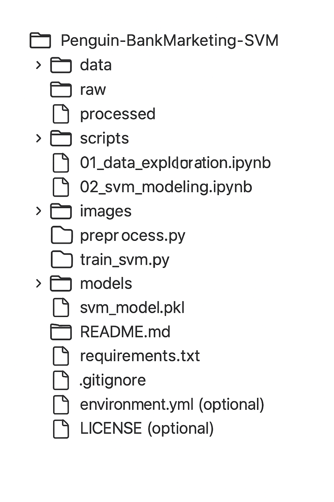

# 📊 Bank Marketing Term Deposit Prediction using SVM

# 📌 Project Overview

This project aims to predict whether a client will subscribe to a term deposit based on various demographic, contact, and economic factors.
We utilize Support Vector Machine (SVM) modeling techniques to perform binary classification on the Portuguese Bank Marketing Dataset.

The project is structured to enable easy data exploration, preprocessing, model training, and evaluation.

# 👥 Authors
	•	Aryan Jain
	•	Zlatan Deni Pujagic

This project was developed as part of the Machine Learning Course (SS25 Semester) at [Your University Name if needed].

# 📁 Folder Structure

#  📊 Dataset Description

The Bank Marketing Dataset contains the following types of attributes:
	•	Bank client data (e.g., age, job, marital status, education)
	•	Contact details (e.g., last contact month, day, communication type)
	•	Previous campaign outcomes
	•	Economic indicators (e.g., employment variation rate, consumer price index)

Detailed descriptions for all variables can be found in the Variables Overview section below.

# 🛠️ How to Run the Project
	1.	Clone the repository:

git clone https://github.com/yourusername/Penguin-BankMarketing-SVM.git

	2.	Create a virtual environment and activate it:

python -m venv venv
source venv/bin/activate  # or venv\Scripts\activate on Windows

	3.	Install dependencies:

pip install -r requirements.txt

	4.	Run the Jupyter Notebooks in order:
	•	01_data_exploration.ipynb
	•	02_svm_modeling.ipynb
	5.	(Optional) Run scripts directly:

python scripts/preprocess.py
python scripts/train_svm.py

# ⚙️ Requirements
	•	Python 3.8+
	•	pandas
	•	numpy
	•	scikit-learn
	•	matplotlib
	•	seaborn
	•	jupyter

(See requirements.txt for the complete list.)

# 📈 Project Highlights
	•	Full data cleaning and feature engineering pipeline.
	•	Support Vector Machine implementation for binary classification.
	•	Cross-validation and confusion matrix for evaluation.
	•	Clear modularized code structure (scripts/ folder).
	•	Professional-quality visualizations for insights.

# 📜 License

This project is licensed under the MIT License — see the LICENSE file for details.

# 🚀 Let’s Predict! -->

Banking, Machine Learning, and the power of Support Vectors — all in one place.
Project by Aryan Jain and Zlatan Deni Pujagic for ML Course SS25.
