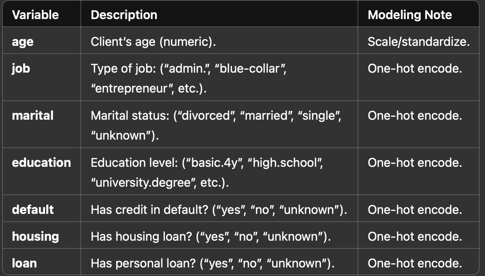
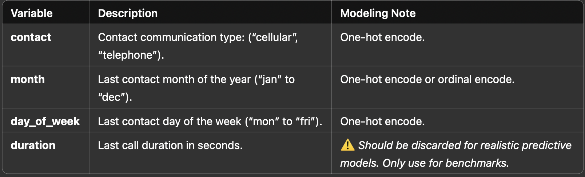
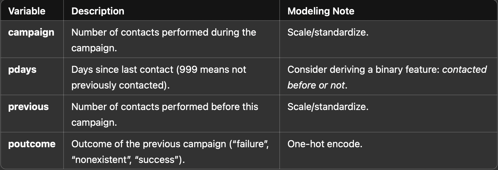
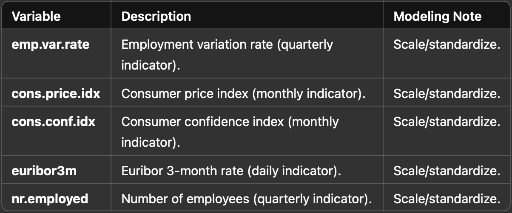
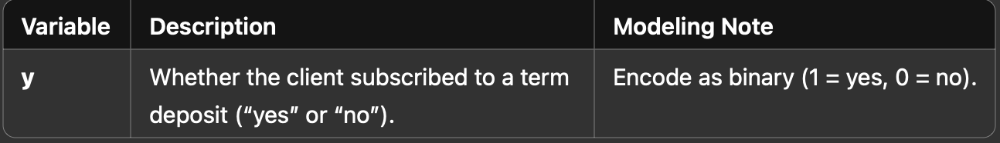

# 📄 Bank Marketing Dataset — Variables Overview

This document explains all the input and output variables of the Bank Marketing Dataset, originally sourced from a Portuguese banking institution.
It includes detailed descriptions and modeling recommendations for each variable.

# 📋 Bank Client Data  
 

# 📞 Last Contact Details

 

# 📈 Other Attributes

 

# 🌍 Social and Economic Context

 

# 🎯 Target Variable

 
