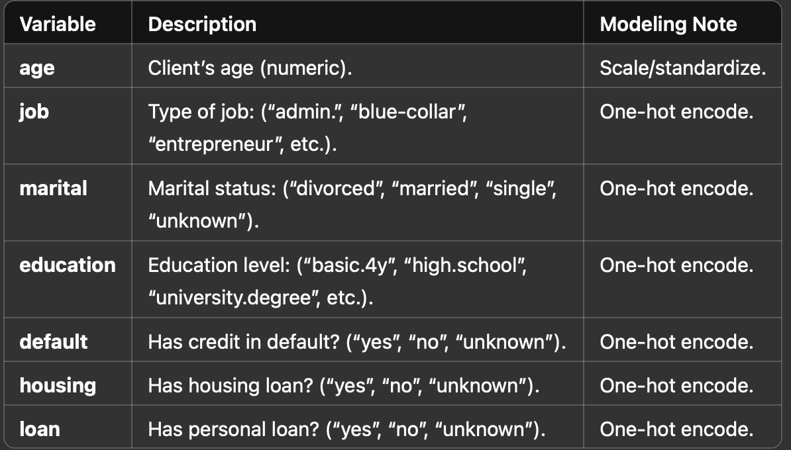

# 📄 Bank Marketing Dataset — Variables Overview

This document explains all the input and output variables of the Bank Marketing Dataset, originally sourced from a Portuguese banking institution.
It includes detailed descriptions and modeling recommendations for each variable.

# 📋 Bank Client Data  
 

# 📞 Last Contact Details

Variable	Description	Modeling Note
contact	Contact communication type: (“cellular”, “telephone”).	One-hot encode.
month	Last contact month of the year (“jan” to “dec”).	One-hot encode or ordinal encode.
day_of_week	Last contact day of the week (“mon” to “fri”).	One-hot encode.
duration	Last call duration in seconds.	⚠️ Should be discarded for realistic predictive models. Only use for benchmarks.

# 📈 Other Attributes

Variable	Description	Modeling Note
campaign	Number of contacts performed during the campaign.	Scale/standardize.
pdays	Days since last contact (999 means not previously contacted).	Consider deriving a binary feature: contacted before or not.
previous	Number of contacts performed before this campaign.	Scale/standardize.
poutcome	Outcome of the previous campaign (“failure”, “nonexistent”, “success”).	One-hot encode.

# 🌍 Social and Economic Context

Variable	Description	Modeling Note
emp.var.rate	Employment variation rate (quarterly indicator).	Scale/standardize.
cons.price.idx	Consumer price index (monthly indicator).	Scale/standardize.
cons.conf.idx	Consumer confidence index (monthly indicator).	Scale/standardize.
euribor3m	Euribor 3-month rate (daily indicator).	Scale/standardize.
nr.employed	Number of employees (quarterly indicator).	Scale/standardize.

# 🎯 Target Variable

Variable	Description	Modeling Note
y	Whether the client subscribed to a term deposit (“yes” or “no”).	Encode as binary (1 = yes, 0 = no).

